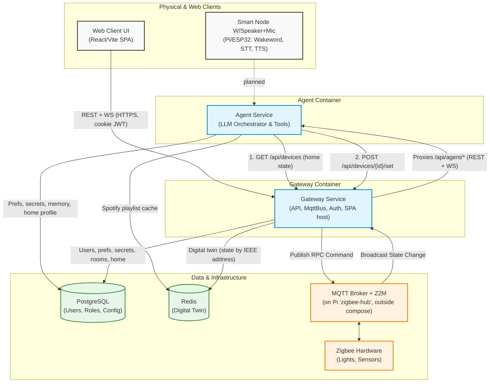

```mermaid
flowchart TD
    %% Edge and UI
    subgraph Clients["Physical & Web Clients"]
        Edge["Smart Node W/Speaker+Mic<br/>(Pi/ESP32: Wakeword, STT, TTS)"]
        UI["Web Client UI<br/>(React/Vite SPA)"]
    end

    %% Agent Service
    subgraph AgentContainer["Agent Container"]
        Agent["Agent Service<br/>(LLM Orchestrator & Tools)"]
    end

    %% Gateway Service
    subgraph GatewayContainer["Gateway Container"]
        Gateway["Gateway Service<br/>(API, MqttBus, Auth, SPA host)"]
    end

    %% Data & Infra
    subgraph Infrastructure["Data & Infrastructure"]
        Postgres[("PostgreSQL<br/>(Users, Roles, Config)")]
        Redis[("Redis<br/>(Digital Twin)")]
        MQTT["MQTT Broker + Z2M<br/>(on Pi 'zigbee-hub', outside compose)"]
        Hardware["Zigbee Hardware<br/>(Lights, Sensors)"]
    end

    %% Flow: Edge/UI to Agent (edge node is planned, not built yet)
    Edge -. "planned" .-> Agent
    UI -- "REST + WS (HTTPS, cookie JWT)" --> Gateway
    Gateway -- "Proxies /api/agent/* (REST + WS)" --> Agent

    %% Flow: Agent to Gateway (agent mints a short-lived JWT for the user)
    Agent -- "1. GET /api/devices (home state)" --> Gateway
    Agent -- "2. POST /api/devices/{id}/set" --> Gateway
    Agent -- "Prefs, secrets, memory, home profile" --> Postgres
    Agent -- "Spotify playlist cache" --> Redis

    %% Flow: Gateway to Data
    Gateway -- "Users, prefs, secrets, rooms, home" --> Postgres
    Gateway -- "Digital twin (state by IEEE address)" --> Redis

    %% Flow: Gateway to Hardware
    Gateway -- "Publish RPC Command" --> MQTT
    MQTT -- "Broadcast State Change" --> Gateway
    MQTT <--> Hardware

    %% Styling
    classDef client fill:#f9f9f9,stroke:#333,stroke-width:2px;
    classDef service fill:#e1f5fe,stroke:#0288d1,stroke-width:2px;
    classDef db fill:#e8f5e9,stroke:#388e3c,stroke-width:2px;
    classDef broker fill:#fff3e0,stroke:#f57c00,stroke-width:2px;
    
    class Edge,UI client;
    class Agent,Gateway service;
    class Postgres,Redis db;
    class MQTT,Hardware broker;
```